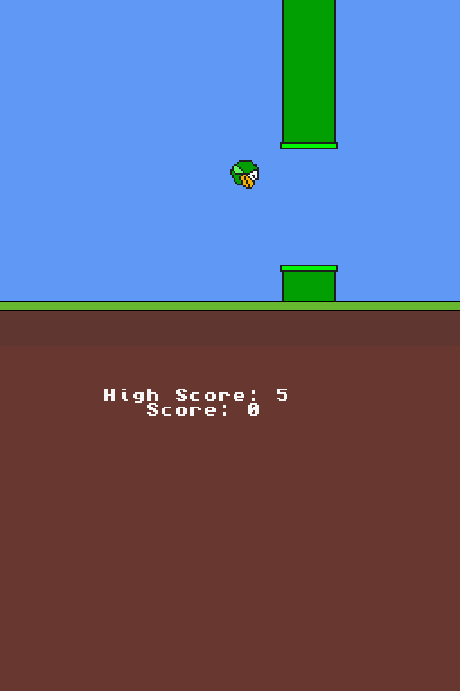

# Cpp-y Bird DS

Cpp-y Bird DS is a port of my C++ Flappy Bird clone, Cpp-y Bird, now for the Nintendo DS!




## Features
- Simple Controls – Just tap the screen or the A-button to make your bird fly!
- Infinite gameplay – Survive as long as you can in an infinite level
- Randomized Pipe Generation – New obstacle layout every time you play
- Score Tracker – Watch your high score climb with each run
- Saves High Score – Keeps your best score!
- Reset High Score - Hold X, B, L, and R, then press SELECT to confirm! For safety, the reset won't be saved until you earn a new high score. If you change your mind, simply reboot the game BEFORE playing again.
- Runs on Real Hardware – DSi (TWiLight Menu++) verified!
- Tiny File Size – Takes up barely any space!
- Coded in C++


## Prerequisites

You need:

- [devkitPro](https://devkitpro.org/) installed (with devkitARM and libnds)
- make


## Compile

```bash
git clone https://github.com/HenryNordin/Cpp-y-Bird-DS.git
cd Cpp-y-Bird-DS
make
